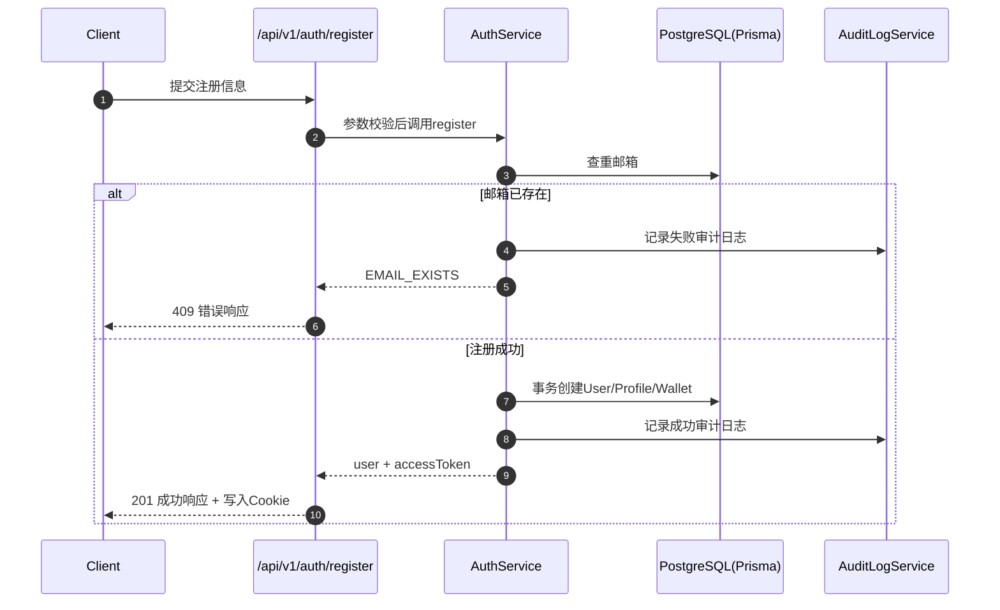
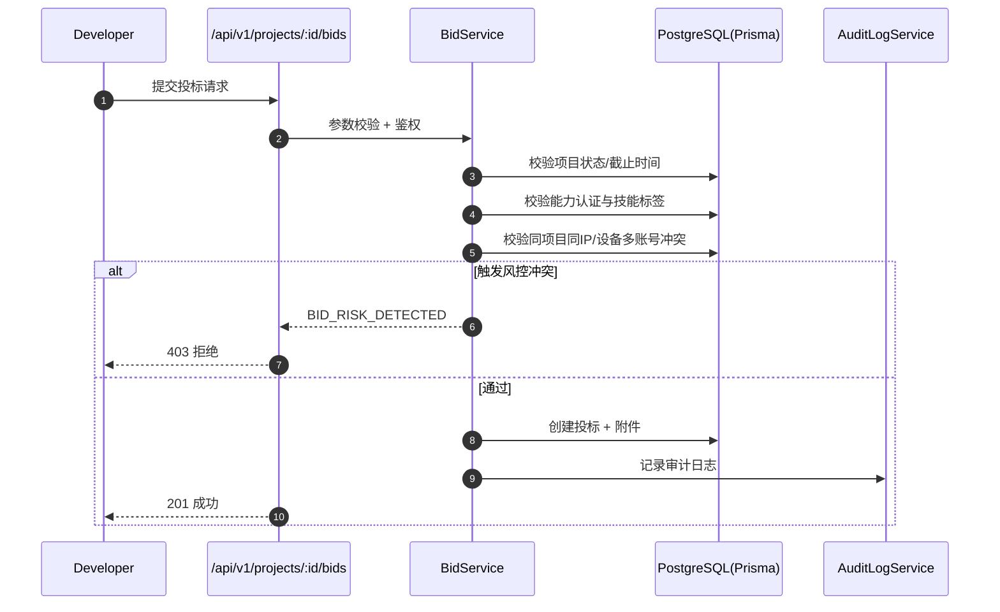
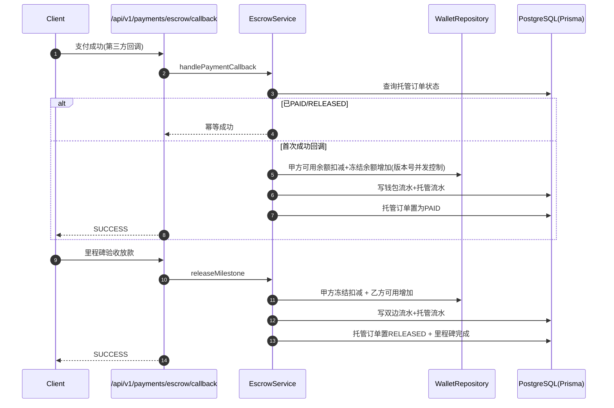
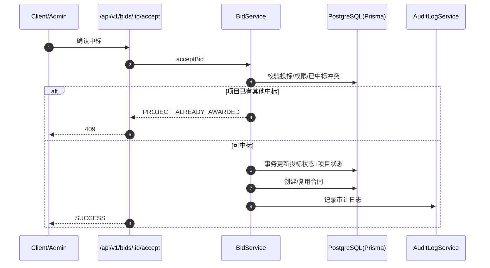
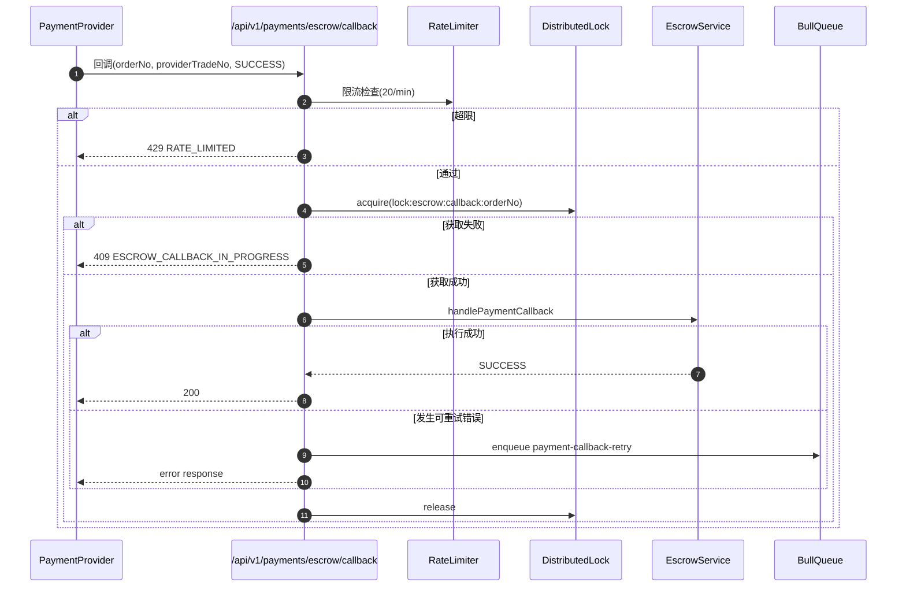

# AI开发者平台（P0：认证与钱包初始化）

本阶段已实现：
- 用户注册（自动创建角色资料与钱包）
- 用户登录（返回并写入 Access Token）
- 钱包查询（鉴权后读取个人钱包）
- 审计日志（注册/登录敏感操作）
- 项目 CRUD（发布、列表、详情、更新、软删除）
- 投标系统（提交、修改、撤回、项目投标列表）
- 基础支付托管（托管下单、支付回调冻结、里程碑放款）
- 退款与仲裁触发（托管退款、争议申请、自动仲裁）

## 1) 接口设计

### POST `/api/v1/auth/register`
请求：
```json
{
  "email": "demo@example.com",
  "password": "Password123!",
  "role": "CLIENT",
  "profile": {
    "companyName": "示例科技",
    "contactName": "张三"
  }
}
```

成功响应：
```json
{
  "code": "SUCCESS",
  "data": {
    "user": {
      "id": "uuid",
      "email": "demo@example.com",
      "role": "CLIENT"
    },
    "accessToken": "jwt_token"
  }
}
```

### POST `/api/v1/auth/login`
请求：
```json
{
  "email": "demo@example.com",
  "password": "Password123!"
}
```

成功响应：
```json
{
  "code": "SUCCESS",
  "data": {
    "user": {
      "id": "uuid",
      "email": "demo@example.com",
      "role": "CLIENT"
    },
    "accessToken": "jwt_token"
  }
}
```

### GET `/api/v1/wallet/me`
请求：Cookie `access_token`

成功响应：
```json
{
  "code": "SUCCESS",
  "data": {
    "userId": "uuid",
    "availableBalance": "0.00",
    "frozenBalance": "0.00",
    "currency": "CNY",
    "totalBalance": "0.00"
  }
}
```

### 失败响应（统一）
```json
{
  "code": "ERROR_CODE",
  "message": "用户友好提示",
  "data": {}
}
```

## 2) 数据库模型

已在 `prisma/schema.prisma` 定义：
- `User`
- `ClientProfile`
- `DeveloperProfile`
- `Wallet`
- `WalletTransaction`
- `AuditLog`

关键点：
- 金额字段使用 `Decimal`
- 所有核心表包含 `id/createdAt/updatedAt/deletedAt`
- 审计日志记录敏感行为

## 3) 核心流程时序图（注册 + 钱包初始化）



## 4) 测试用例

`tests/unit/auth.validation.test.ts`
- 注册参数通过场景
- 登录密码过短失败场景

`tests/unit/wallet.service.test.ts`
- 钱包总额计算精度场景（Decimal）

## 5) 安全风险点与防护措施

- 风险：密码泄露  
  防护：`bcrypt` cost=12，仅存 `passwordHash`

- 风险：未授权访问钱包  
  防护：钱包接口强制验证 JWT（Cookie `access_token`）

- 风险：关键行为不可追溯  
  防护：注册/登录写入 `AuditLog`

- 风险：输入污染  
  防护：所有入口采用 Zod 校验

## 6) 性能优化建议

- 登录接口增加 Redis 限流（按IP + 账号）
- 用户会话可引入 Redis 黑名单实现登出失效控制
- 钱包读接口可短期缓存（TTL 15~30秒），资金变动时主动失效

## 7) 本地启动（Node 安装后）

1. 安装依赖：`npm install`
2. 配置环境变量（参考 `.env.example`）
3. 生成客户端：`npm run prisma:generate`
4. 执行迁移：`npm run prisma:migrate`
5. 启动开发：`npm run dev`

## 8) 项目 CRUD 接口补充

### POST `/api/v1/projects`
- 角色：`CLIENT`
- 作用：创建项目（默认 `DRAFT`）

### GET `/api/v1/projects`
- 角色：`CLIENT|DEVELOPER|ADMIN`
- 作用：分页查询项目（支持 `status` 过滤）

### GET `/api/v1/projects/:id`
- 角色：`CLIENT|DEVELOPER|ADMIN`
- 作用：项目详情

### PATCH `/api/v1/projects/:id`
- 角色：`CLIENT|ADMIN`（甲方本人或管理员）
- 作用：更新项目信息与状态
- 状态机：
  - `DRAFT -> PUBLISHED|CANCELLED`
  - `PUBLISHED -> BIDDING|CANCELLED`
  - `BIDDING -> CLOSED|AWARDED|CANCELLED`

### DELETE `/api/v1/projects/:id`
- 角色：`CLIENT|ADMIN`
- 作用：软删除项目（仅 `DRAFT|PUBLISHED|CANCELLED`）

## 9) 投标系统接口补充

### POST `/api/v1/projects/:id/bids`
- 角色：`DEVELOPER`
- 作用：提交投标
- 核心约束：
  - 项目必须处于 `PUBLISHED` 或 `BIDDING`
  - 投标截止后禁止提交
  - 同一开发者在同项目仅允许一个有效投标
  - 需通过能力认证，且技能认证覆盖项目标签
  - 防串标：同一项目若存在相同 IP/设备但不同账号投标则拒绝

### GET `/api/v1/projects/:id/bids`
- 角色：`CLIENT|DEVELOPER|ADMIN`
- 作用：查询项目投标列表

### PATCH `/api/v1/bids/:id`
- 角色：`DEVELOPER`
- 作用：修改投标（仅 `PENDING` 且截止前）

### POST `/api/v1/bids/:id/withdraw`
- 角色：`DEVELOPER`
- 作用：撤回投标（仅 `PENDING` 且截止前）

## 10) 投标流程时序图（提交 + 防串标）



## 11) 资金托管接口补充

### POST `/api/v1/payments/escrow/orders`
- 角色：`CLIENT`
- 作用：创建托管订单（`PENDING`）

### POST `/api/v1/payments/escrow/callback`
- 角色：`payment-provider`（回调入口）
- 作用：支付成功后冻结甲方可用余额到冻结余额
- 幂等：订单已是 `PAID/RELEASED` 时直接幂等返回

### POST `/api/v1/milestones/:id/release`
- 角色：`CLIENT|ADMIN`
- 作用：里程碑验收放款（甲方冻结余额 -> 乙方可用余额）
- 幂等：里程碑已完成直接返回

## 12) 托管放款时序图（冻结 -> 解冻支付）



## 13) 安全与风控补充

- 支付回调幂等：基于 `EscrowOrder` 状态判断与唯一 `providerTradeNo`
- 资金并发控制：钱包 `version` 乐观锁 + 余额阈值校验
- 资金流水完整性：冻结/放款均记录 `WalletTransaction` 与 `EscrowLedger`

## 14) 退款与仲裁接口补充

### POST `/api/v1/payments/escrow/orders/:orderNo/refund`
- 角色：`CLIENT|ADMIN`
- 作用：托管退款（仅 `PAID` 且未放款）
- 幂等：已退款订单重复请求直接返回幂等结果

### POST `/api/v1/disputes`
- 角色：`CLIENT|DEVELOPER`（限合约参与方）
- 作用：发起争议
- 仲裁触发规则：
  - 争议金额 `> 5000`：自动进入 `IN_ARBITRATION`
  - 双方均发起申请：进入 `IN_ARBITRATION`

## 15) 回调签名校验

- 回调头：`x-payment-signature`
- 算法：`HMAC-SHA256(rawBody, PAYMENT_CALLBACK_SECRET)`
- 风险防护：
  - 签名错误直接拒绝
  - 订单状态幂等防重放

## 16) 仲裁裁决后台接口

### POST `/api/v1/admin/disputes/:id/resolve`
- 角色：`ADMIN`
- 动作：
  - `REJECT`：驳回争议（状态 `REJECTED`）
  - `FULL_REFUND`：全额退款（托管 `PAID -> REFUNDED`）
  - `PARTIAL_REFUND`：部分退款（客户端退回 + 乙方部分放款）
  - `RELEASE`：放款给乙方（托管 `PAID -> RELEASED`）

裁决动作均记录审计日志与资金流水，确保可追溯。

## 17) 通知与仲裁列表

### GET `/api/v1/notifications/me`
- 角色：`CLIENT|DEVELOPER|ADMIN`
- 作用：分页查询当前用户通知

### GET `/api/v1/admin/disputes`
- 角色：`ADMIN`
- 作用：分页查询争议单，支持 `status/projectId/keyword` 过滤

## 19) 后台审核与风控

### 风控事件
- `GET /api/v1/admin/risk-events`：管理员分页查询风控事件
- `POST /api/v1/admin/risk-events/:id/action`：风控处置动作
  - `MARK_FALSE_POSITIVE`
  - `MARK_MITIGATED`
  - `FREEZE_DEVELOPER`
  - `ESCALATE_REVIEW`

### 审核单
- `GET /api/v1/admin/reviews`：管理员分页查询审核单
- `POST /api/v1/admin/reviews/:id/resolve`：审核通过/驳回

### 自动风控接入点
- 投标阶段命中“同项目同IP/设备多账号”时自动写入 `risk_events`
- 后台可进一步升级为人工审核单

### 实时通知机制
- `NotificationService` 落库通知到 `notifications` 表
- 同时通过 `RealtimeEventBus` 发出 `notification.created` 事件
- 可由后续 Socket.io 网关订阅并推送到前端会话

## 18) Socket.io 网关与通知读状态

### Socket 初始化
- 端点：`GET /api/socket/io`
- 文件：`src/pages/api/socket/io.ts`
- 连接参数：`auth.token = accessToken`
- 连接成功后自动加入房间：`user:{userId}`

### 通知接口
- `GET /api/v1/notifications/me`：分页列表
- `GET /api/v1/notifications/me/unread-count`：未读数量
- `POST /api/v1/notifications/:id/read`：单条已读
- `POST /api/v1/notifications/read/batch`：批量已读

### 已读实时事件
- 事件名：`notification.read`
- 单条已读载荷：`{ notificationId, unreadCount }`
- 批量已读载荷：`{ notificationIds, updatedCount, unreadCount }`

## 20) 中标确认闭环（新增）

### 接口
- `POST /api/v1/bids/:id/accept`
- 角色：`CLIENT|ADMIN`
- 作用：确认某条投标中标，触发状态流转与合约生成

成功响应示例：
```json
{
  "code": "SUCCESS",
  "data": {
    "projectId": "project-1",
    "acceptedBidId": "bid-1",
    "rejectedCount": 3,
    "projectStatus": "AWARDED",
    "contractId": "contract-1",
    "idempotent": false
  }
}
```

### 核心逻辑
- 仅项目甲方本人或管理员可操作
- 目标投标必须是 `PENDING/ACCEPTED`
- 同项目存在其他 `ACCEPTED` 投标时拒绝（防止多中标）
- 事务内执行：
  - 目标投标 `PENDING -> ACCEPTED`
  - 同项目其他 `PENDING -> REJECTED`
  - 项目状态 `-> AWARDED`
  - 自动创建或复用 `Contract`
- 写入审计日志 `BID_ACCEPT`

### 时序图（Mermaid）


### 测试
- `tests/unit/bid.accept.service.test.ts`
  - 成功中标并生成合约
  - 已有其他中标冲突
  - 非项目所有者拒绝

### 风险点与防护
- 风险：同项目并发中标导致多赢家  
  防护：中标冲突检查 + 单事务写入
- 风险：敏感操作不可追溯  
  防护：统一写审计日志（含项目与合约上下文）

### 性能优化建议
- 为 `bids(projectId,status,createdAt)` 增加复合索引以优化中标冲突查询
- 通过缓存项目中标态减少详情页重复拉取

## 21) 中标后里程碑模板初始化（新增）

### 接口
- `POST /api/v1/projects/:id/milestones/template`
- 角色：`CLIENT|ADMIN`
- 作用：在项目中标后一次性初始化里程碑模板

请求示例：
```json
{
  "milestones": [
    { "title": "需求分析", "amount": 1000, "dueAt": "2026-04-01T00:00:00.000Z" },
    { "title": "交付上线", "amount": 2000, "dueAt": "2026-05-01T00:00:00.000Z" }
  ]
}
```

### 核心约束
- 项目必须为 `AWARDED`
- 必须存在中标合约 `Contract`
- 里程碑总金额必须与合约金额一致
- 截止时间需升序，标题不可重复
- 已初始化里程碑时禁止重复提交

### 测试
- `tests/unit/project.milestone-template.service.test.ts`
  - 正常初始化
  - 金额不匹配拒绝
  - 重复初始化拒绝

## 22) 开发者能力验证与投标初始化（新增）

### 能力验证接口
- `GET /api/v1/developer/capability/me`：获取能力状态、可选技能、已认证技能
- `POST /api/v1/developer/capability/verify`：提交能力验证（技能列表）

请求示例：
```json
{
  "skills": ["nlp", "rag", "agent"]
}
```

### 投标列表初始化接口
- `GET /api/v1/bids/me`
- 作用：根据当前角色返回投标列表  
  - `DEVELOPER`：返回本人投标  
  - `CLIENT`：返回本人项目收到的投标  
  - `ADMIN`：返回全量投标

### 前端补齐
- 个人主页 `profile` 新增“能力验证”模块（技能勾选 + 提交验证）
- 投标管理页 `bids` 改为真实接口初始化，不再使用静态假数据
- 总览页重点任务支持“个人/智能体”撰写，并持久化到本地

## 23) 一键本地启动脚本

项目根目录已提供 `start-dev.ps1`，会自动：
- 检查并启动本地 PostgreSQL（`D:\somethings\tools\pgdata`）
- 启动 `npm run dev`

执行方式：
```powershell
cd D:\somethings\ai-dev-platform
.\start-dev.ps1
```

## 24) 支付链路限流 + 分布式锁 + 重试队列（新增）

### 接口行为增强
- `POST /api/v1/payments/escrow/callback`
  - 新增支付回调限流：按请求IP `20/min`
  - 新增分布式锁：`escrow:callback:{orderNo}`，防止重复并发入账
  - 新增失败补偿：满足重试条件时写入 `payment-callback-retry` 队列

- `POST /api/v1/milestones/:id/release`
  - 新增放款限流：按用户 `20/min`
  - 新增分布式锁：`escrow:release:{milestoneId}`，防止重复并发放款

### 关键实现
- Redis 客户端：`src/lib/infra/redis/RedisClient.ts`
- 分布式锁：`src/lib/infra/redis/DistributedLockService.ts`
- 限流器：`src/lib/infra/redis/RateLimiterService.ts`
- 重试队列：`src/lib/queue/PaymentCallbackRetryQueue.ts`

### 队列说明
- 队列名：`payment-callback-retry`
- 默认重试策略：`attempts=5`、指数退避（初始 1s）
- 幂等 JobKey：`payment-callback:{orderNo}:{providerTradeNo}:{paymentStatus}`

### 时序图（回调并发保护 + 重试）


## 25) 生产部署（阿里云ECS + Docker）（新增）

你已选择：ECS + Docker；PostgreSQL/Redis 使用托管服务；暂不绑定域名（先用公网IP）。

### 25.1 ECS 侧准备
- 系统：Ubuntu 22.04/24.04（推荐）
- 安全组：放行 `TCP 22`、`TCP 3000`（后续绑定域名可改为 `80/443`）

安装 Docker（Ubuntu）：
```bash
sudo apt-get update
sudo apt-get install -y ca-certificates curl gnupg
sudo install -m 0755 -d /etc/apt/keyrings
curl -fsSL https://download.docker.com/linux/ubuntu/gpg | sudo gpg --dearmor -o /etc/apt/keyrings/docker.gpg
sudo chmod a+r /etc/apt/keyrings/docker.gpg
echo \
  "deb [arch=$(dpkg --print-architecture) signed-by=/etc/apt/keyrings/docker.gpg] https://download.docker.com/linux/ubuntu \
  $(. /etc/os-release && echo $VERSION_CODENAME) stable" | \
  sudo tee /etc/apt/sources.list.d/docker.list > /dev/null
sudo apt-get update
sudo apt-get install -y docker-ce docker-ce-cli containerd.io docker-compose-plugin
sudo usermod -aG docker $USER
newgrp docker
```

### 25.2 把代码上传到 ECS
方式任选其一：
- `scp`：将本地 `ai-dev-platform` 上传到 ECS（不建议上传 `node_modules`）
- 或在 ECS 上 `git clone`（建议：后续把项目推 GitHub）

### 25.3 配置生产环境变量
在 ECS 项目目录复制并填写：
- `.env.production.example` → `.env.production`

至少需要配置：
- `DATABASE_URL`：托管 PostgreSQL 连接串
- `REDIS_URL`：托管 Redis 连接串（用于限流/分布式锁/队列）
- `JWT_ACCESS_SECRET`、`JWT_EMAIL_VERIFY_SECRET`、`PAYMENT_CALLBACK_SECRET`
- `NEXT_PUBLIC_APP_URL`：填 `http://<ECS公网IP>:3000`

### 25.4 构建并启动
在 ECS 项目目录执行：
```bash
docker compose --env-file .env.production up -d --build
```

查看日志：
```bash
docker compose logs -f web
```

### 25.5 访问验证
浏览器访问：
- `http://<ECS公网IP>:3000/login`

### 25.6 数据库迁移（生产）
如果托管数据库是全新库，需要执行迁移：
```bash
docker compose exec web npm run prisma:deploy
```

> 说明：目前 `Dockerfile` 直接运行 `next start`，数据库迁移需要你在首次部署时手动执行一次（或后续我可以帮你做成自动启动脚本：启动前自动迁移/自动失败退出）。

## 26) Vercel 免费部署 Demo（新增）

### 26.1 仓库
- GitHub：`https://github.com/yingjiangnodaisiki/CS102`

### 26.2 构建与迁移
已在 `package.json` 增加 `vercel-build`，Vercel 会在构建阶段执行：
- `prisma generate`
- `prisma migrate deploy`
- `next build`

### 26.3 必填环境变量（Vercel Project → Settings → Environment Variables）
- `DATABASE_URL`
- `JWT_ACCESS_SECRET`
- `JWT_EMAIL_VERIFY_SECRET`
- `PAYMENT_CALLBACK_SECRET`（支付回调用，建议填）
- `NEXT_PUBLIC_APP_URL`（填 Vercel 分配域名，如 `https://xxx.vercel.app`）
- **SMTP（生产注册必填）**：`SMTP_HOST` / `SMTP_PORT` / `SMTP_USER` / `SMTP_PASS` / `SMTP_FROM`  
  生产环境未配置 SMTP 时 **无法注册**（避免产生永远无法登录的未验证账号）。本地开发未配置 SMTP 时，注册会自动标记邮箱已验证，便于调试。

可选：
- `REDIS_URL`（用于分布式锁/限流/队列；不填会降级为内存锁/内存限流）
- `BLOB_READ_WRITE_TOKEN` 或 `VERCEL_BLOB_READ_WRITE_TOKEN`（**头像文件上传**：Vercel Dashboard → **Storage** → **Blob** → 创建 Blob Store → 将 **Read/Write Token** 加到环境变量；接口 `POST /api/v1/files/avatar` 会写入 Blob 并返回公网 URL；部分项目控制台可能生成 `VERCEL_BLOB_READ_WRITE_TOKEN`，二者任选其一配置即可）
- `EMAIL_VERIFY_RATE_LIMIT_DISABLED=true`（仅调试：关闭邮箱验证链接请求限流）

### 26.3.1 注册与邮箱验证流程
- 注册成功后 **不再自动登录**；用户需打开邮件中的链接访问 `/verify-email?token=...`，验证通过后再登录。
- 未验证时登录会返回 `EMAIL_NOT_VERIFIED`，登录页可点 **重发验证邮件**（受限流保护）。
- 部署新迁移 `mark_existing_users_email_verified` 后，**历史用户**会被批量标记为已验证，避免全员被挡在登录外。

### 26.3.2 发信域名与 DNS（SPF / DKIM / DMARC）
「DNS 保护」在邮件场景通常指：**让收件方（QQ/163/Gmail 等）信任你的发件域名**，减少进垃圾箱或被拒收。需在 **发件域名**（`SMTP_FROM` 里的域名，如 `boki.help`）的 DNS 服务商处添加记录（具体值以你使用的 SMTP 服务商控制台为准，如阿里云邮件推送、SendGrid、Resend、企业邮箱等）：
- **SPF**：TXT 记录，授权哪些服务器可以代该域名发信。
- **DKIM**：TXT 记录（或 CNAME），用于签名验证。
- **DMARC**：`_dmarc` 子域 TXT，声明对齐策略与报告邮箱。

站点访问域名（如 Vercel 自定义域）的 HTTPS 由 Vercel 自动处理；若需要 **WAF / DDoS 防护**，需在 DNS 层接入 Cloudflare 等专业服务（与邮件 DNS 是两套配置）。

### 26.4 免费层注意事项（重要）
- **头像上传**：Vercel 上已接入 `@vercel/blob`，并对 **MIME 为空** 的移动端图片做了魔数校验与扩展名推断。请确认环境变量中已配置 **Blob Token** 且 **重新部署** 后生效。未配置时仍可填「头像地址（URL）」。自建 Docker/本地开发仍写入 `public/uploads/avatars`。
- Socket.io 长连接在 Vercel 免费层不适合长期稳定在线（Demo 可以暂时不依赖实时能力）。

### 26.5 安全加固（CORS / 响应头 / 管理端）

| 优先级 | 项 | 实现说明 |
|--------|----|----------|
| **P1** | CORS 限制具体域名 | Next.js 16 使用 `src/proxy.ts`（勿与旧版 `middleware.ts` 并存）。其中对 `/api/*` 在 **Origin 在白名单内** 时设置 `Access-Control-Allow-*`。白名单 = `ALLOWED_ORIGINS`（逗号分隔）+ `NEXT_PUBLIC_APP_URL`；开发环境额外允许 `http://localhost:3000`、`http://127.0.0.1:3000`。**生产环境**若两者都未配置，则不对任何跨域 Origin 反射。多域名（如 `www` 与根域、`*.vercel.app` Preview）请显式写入 `ALLOWED_ORIGINS`。 |
| **P2** | 弱化部署指纹 | `next.config.mjs` 已设 `poweredByHeader: false`（去掉 `X-Powered-By: Next.js`），并增加 `Referrer-Policy`、`X-Content-Type-Options`、`Permissions-Policy`。`proxy` 对 API 响应会删除 `x-powered-by`（若仍存在）。**说明**：托管在 Vercel 时，边缘层仍可能添加 `x-vercel-id` 等字段，应用代码**无法保证完全移除**，若需更强隐藏需换自建反代或与企业支持沟通。 |
| **P2** | `/admin` 服务端鉴权 | `src/app/(platform)/admin/layout.tsx` 在 **服务端**校验 `access_token` 且 `role === ADMIN`，否则重定向登录或 `/dashboard`（管理 API 仍保持各路由内 `getAuthUser` + 角色校验）。 |
| **P3** | Security Checkpoint 频率 | 运维项：在 Vercel Analytics / 日志中关注异常流量与人机验证触发；结合 WAF（如前置 Cloudflare）降低误伤真实用户。 |
| **P3** | 授权深度扫描 | 运维项：按节奏对公网环境做经授权的渗透/依赖扫描（如 `npm audit`、SAST/DAST），与发版节奏挂钩。 |
